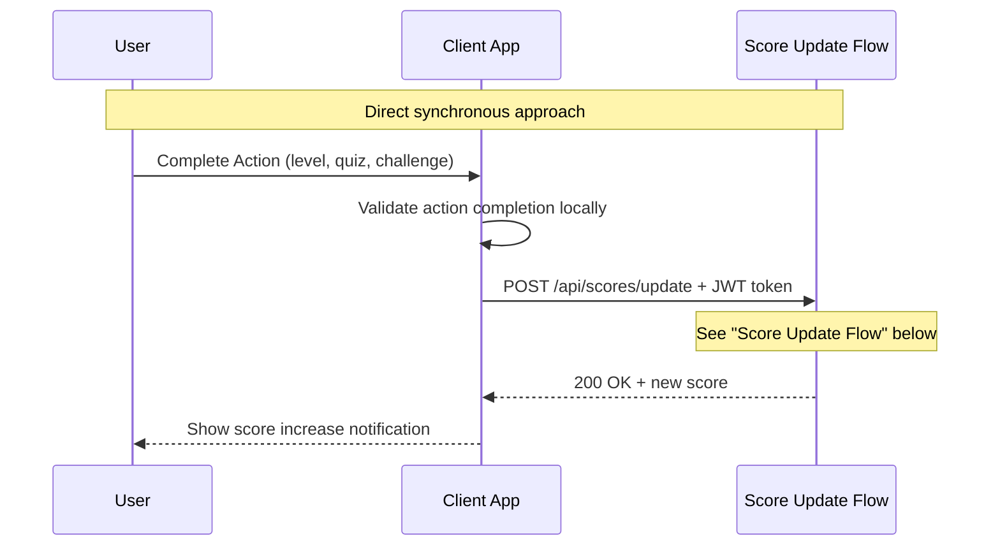
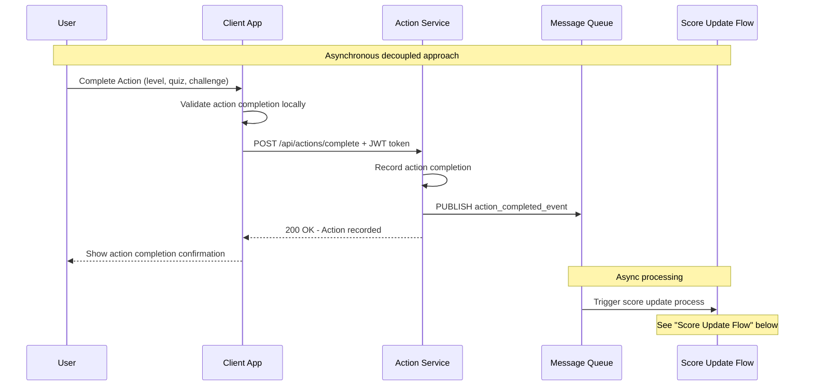
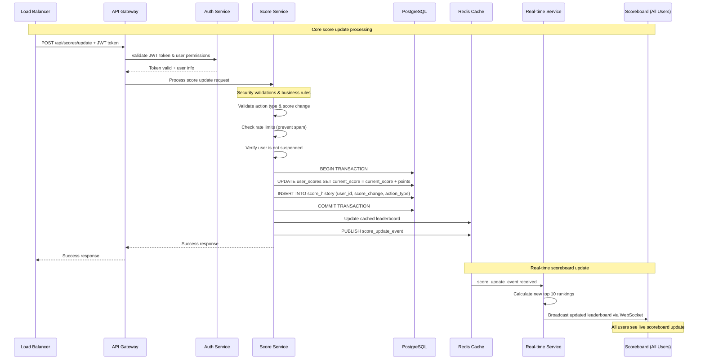
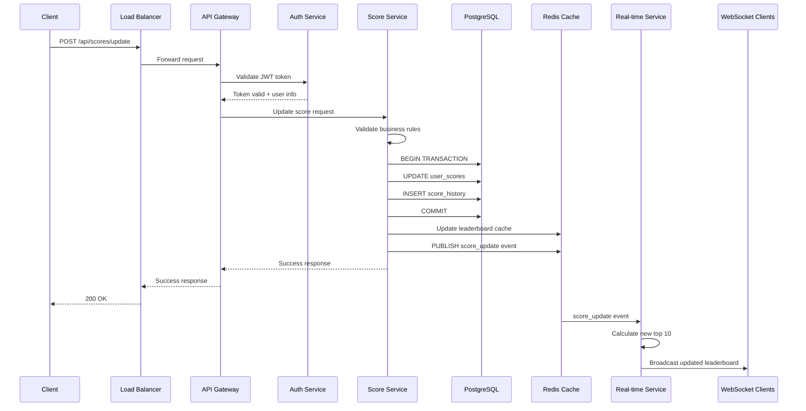
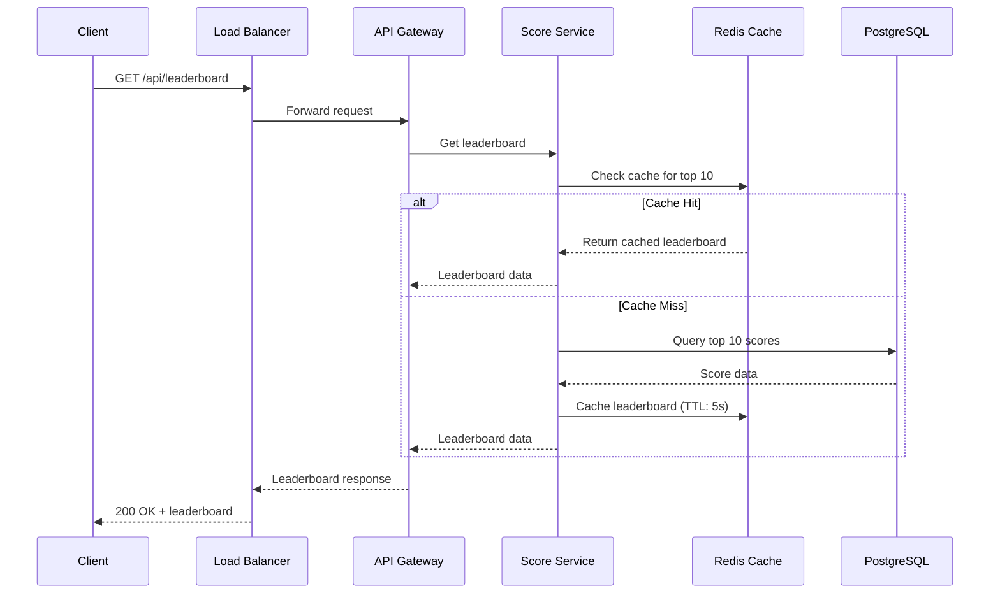
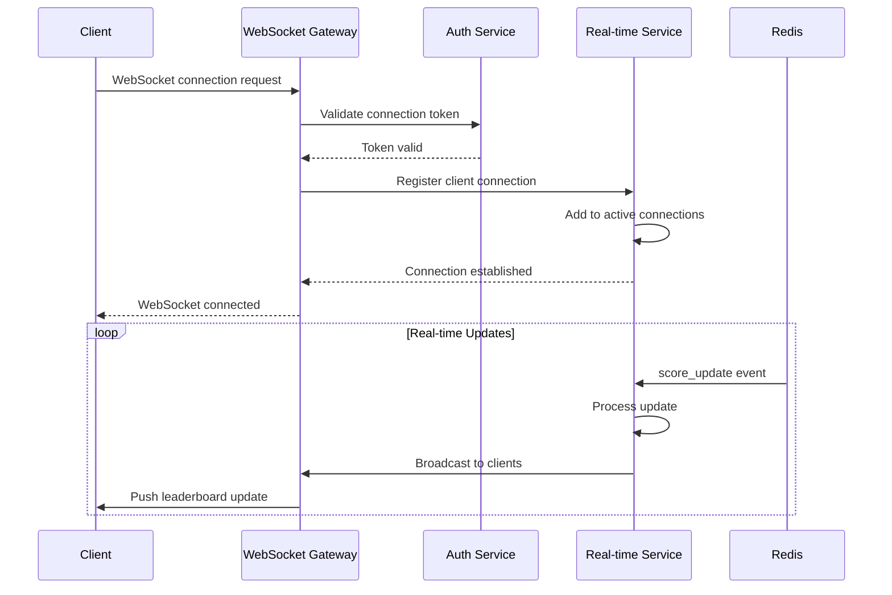
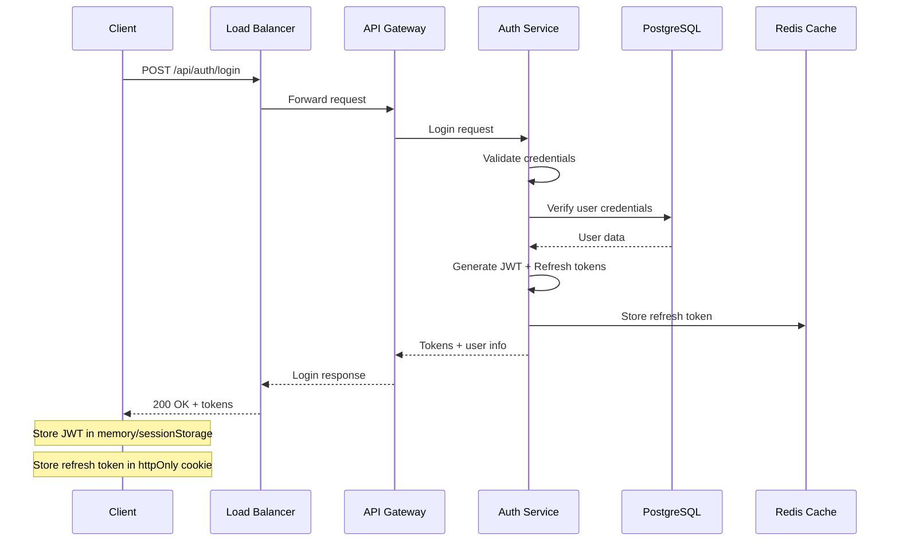
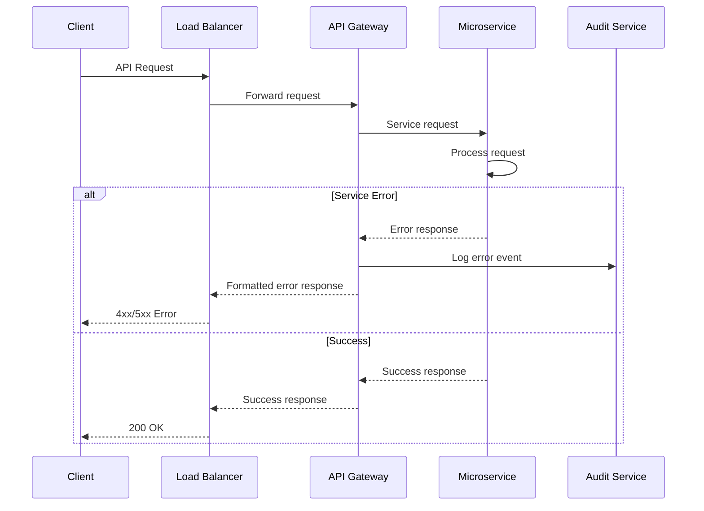
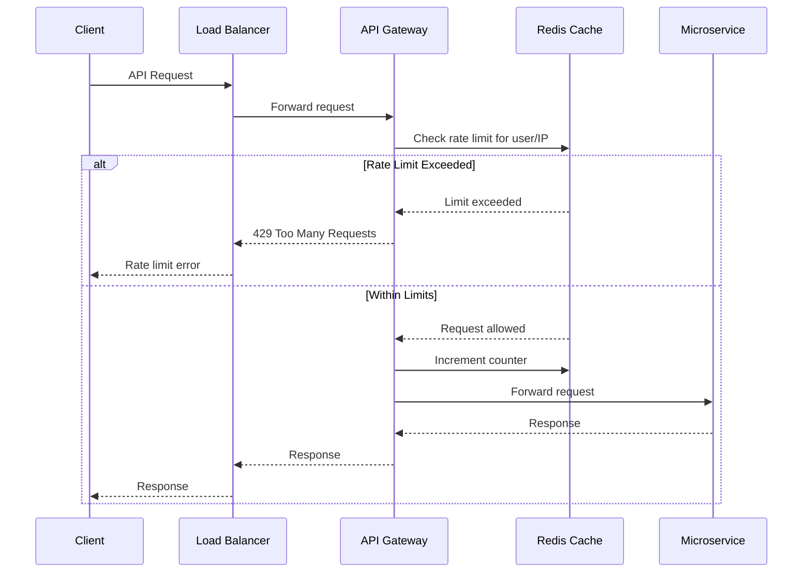

# API Flow Diagrams

## User Action Triggering (Two Approaches)

### Approach 1: Direct API Call

### Approach 2: Event-Driven

## Score Update Flow

## Leaderboard Retrieval Flow

## WebSocket Connection Flow

## Authentication Flow

## Error Handling Flow

## Rate Limiting Flow

