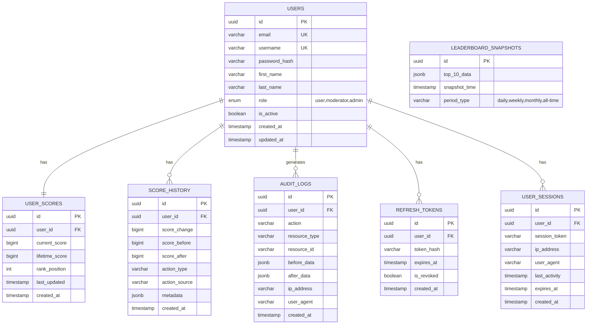

# Database Schema Design

## Entity Relationship Diagram



## Table Definitions

### Users Table
```sql
CREATE TABLE users (
    id UUID PRIMARY KEY DEFAULT gen_random_uuid(),
    email VARCHAR(255) UNIQUE NOT NULL,
    username VARCHAR(50) UNIQUE NOT NULL,
    password_hash VARCHAR(255) NOT NULL,
    first_name VARCHAR(100),
    last_name VARCHAR(100),
    role user_role DEFAULT 'user',
    is_active BOOLEAN DEFAULT true,
    created_at TIMESTAMP WITH TIME ZONE DEFAULT CURRENT_TIMESTAMP,
    updated_at TIMESTAMP WITH TIME ZONE DEFAULT CURRENT_TIMESTAMP
);

CREATE TYPE user_role AS ENUM ('user', 'moderator', 'admin');
```

### User Scores Table
```sql
CREATE TABLE user_scores (
    id UUID PRIMARY KEY DEFAULT gen_random_uuid(),
    user_id UUID NOT NULL REFERENCES users(id) ON DELETE CASCADE,
    current_score BIGINT DEFAULT 0,
    lifetime_score BIGINT DEFAULT 0,
    rank_position INTEGER,
    last_updated TIMESTAMP WITH TIME ZONE DEFAULT CURRENT_TIMESTAMP,
    created_at TIMESTAMP WITH TIME ZONE DEFAULT CURRENT_TIMESTAMP,
    
    CONSTRAINT user_scores_user_id_unique UNIQUE (user_id),
    CONSTRAINT user_scores_score_positive CHECK (current_score >= 0),
    CONSTRAINT user_scores_lifetime_positive CHECK (lifetime_score >= 0)
);

-- Indexes for performance
CREATE INDEX idx_user_scores_current_score ON user_scores(current_score DESC);
CREATE INDEX idx_user_scores_rank_position ON user_scores(rank_position);
CREATE INDEX idx_user_scores_last_updated ON user_scores(last_updated);
```

### Score History Table
```sql
CREATE TABLE score_history (
    id UUID PRIMARY KEY DEFAULT gen_random_uuid(),
    user_id UUID NOT NULL REFERENCES users(id) ON DELETE CASCADE,
    score_change BIGINT NOT NULL,
    score_before BIGINT NOT NULL,
    score_after BIGINT NOT NULL,
    action_type VARCHAR(50) NOT NULL,
    action_source VARCHAR(100),
    metadata JSONB,
    created_at TIMESTAMP WITH TIME ZONE DEFAULT CURRENT_TIMESTAMP
);

-- Partitioning by month for better performance
CREATE TABLE score_history_y2025m01 PARTITION OF score_history
    FOR VALUES FROM ('2025-01-01') TO ('2025-02-01');

-- Indexes
CREATE INDEX idx_score_history_user_id ON score_history(user_id);
CREATE INDEX idx_score_history_created_at ON score_history(created_at);
CREATE INDEX idx_score_history_action_type ON score_history(action_type);
```

### Leaderboard Snapshots Table
```sql
CREATE TABLE leaderboard_snapshots (
    id UUID PRIMARY KEY DEFAULT gen_random_uuid(),
    top_10_data JSONB NOT NULL,
    snapshot_time TIMESTAMP WITH TIME ZONE DEFAULT CURRENT_TIMESTAMP,
    period_type VARCHAR(20) NOT NULL DEFAULT 'all-time',
    
    CONSTRAINT valid_period_type CHECK (period_type IN ('daily', 'weekly', 'monthly', 'all-time'))
);

-- Indexes
CREATE INDEX idx_leaderboard_snapshots_period_time ON leaderboard_snapshots(period_type, snapshot_time DESC);
```

### Audit Logs Table
```sql
CREATE TABLE audit_logs (
    id UUID PRIMARY KEY DEFAULT gen_random_uuid(),
    user_id UUID REFERENCES users(id) ON DELETE SET NULL,
    action VARCHAR(100) NOT NULL,
    resource_type VARCHAR(50) NOT NULL,
    resource_id VARCHAR(255),
    before_data JSONB,
    after_data JSONB,
    ip_address INET,
    user_agent TEXT,
    created_at TIMESTAMP WITH TIME ZONE DEFAULT CURRENT_TIMESTAMP
);

-- Partitioning by month
CREATE TABLE audit_logs_y2025m01 PARTITION OF audit_logs
    FOR VALUES FROM ('2025-01-01') TO ('2025-02-01');

-- Indexes
CREATE INDEX idx_audit_logs_user_id ON audit_logs(user_id);
CREATE INDEX idx_audit_logs_created_at ON audit_logs(created_at);
CREATE INDEX idx_audit_logs_action ON audit_logs(action);
CREATE INDEX idx_audit_logs_resource ON audit_logs(resource_type, resource_id);
```

### Refresh Tokens Table
```sql
CREATE TABLE refresh_tokens (
    id UUID PRIMARY KEY DEFAULT gen_random_uuid(),
    user_id UUID NOT NULL REFERENCES users(id) ON DELETE CASCADE,
    token_hash VARCHAR(255) NOT NULL,
    expires_at TIMESTAMP WITH TIME ZONE NOT NULL,
    is_revoked BOOLEAN DEFAULT false,
    created_at TIMESTAMP WITH TIME ZONE DEFAULT CURRENT_TIMESTAMP,
    
    CONSTRAINT refresh_tokens_token_hash_unique UNIQUE (token_hash)
);

-- Indexes
CREATE INDEX idx_refresh_tokens_user_id ON refresh_tokens(user_id);
CREATE INDEX idx_refresh_tokens_expires_at ON refresh_tokens(expires_at);
```

### User Sessions Table
```sql
CREATE TABLE user_sessions (
    id UUID PRIMARY KEY DEFAULT gen_random_uuid(),
    user_id UUID NOT NULL REFERENCES users(id) ON DELETE CASCADE,
    session_token VARCHAR(255) NOT NULL,
    ip_address INET,
    user_agent TEXT,
    last_activity TIMESTAMP WITH TIME ZONE DEFAULT CURRENT_TIMESTAMP,
    expires_at TIMESTAMP WITH TIME ZONE NOT NULL,
    created_at TIMESTAMP WITH TIME ZONE DEFAULT CURRENT_TIMESTAMP,
    
    CONSTRAINT user_sessions_session_token_unique UNIQUE (session_token)
);

-- Indexes
CREATE INDEX idx_user_sessions_user_id ON user_sessions(user_id);
CREATE INDEX idx_user_sessions_session_token ON user_sessions(session_token);
CREATE INDEX idx_user_sessions_expires_at ON user_sessions(expires_at);
```

## Materialized Views for Performance

### Top 10 Leaderboard View
```sql
CREATE MATERIALIZED VIEW top_10_leaderboard AS
SELECT 
    u.id,
    u.username,
    u.first_name,
    u.last_name,
    us.current_score,
    us.rank_position,
    us.last_updated
FROM user_scores us
JOIN users u ON us.user_id = u.id
WHERE u.is_active = true
ORDER BY us.current_score DESC, us.last_updated ASC
LIMIT 10;

-- Refresh the view periodically
CREATE UNIQUE INDEX idx_top_10_leaderboard_id ON top_10_leaderboard(id);
```

## Database Optimization Strategies

### Indexing Strategy
1. **Composite Indexes**: Create indexes on frequently queried column combinations
2. **Partial Indexes**: Index only active users for leaderboard queries
3. **Expression Indexes**: Index computed values if needed

### Partitioning Strategy
1. **Time-based Partitioning**: Partition audit logs and score history by month
2. **Range Partitioning**: Consider partitioning user scores by score ranges if needed

### Performance Monitoring
1. **Query Performance**: Monitor slow queries with pg_stat_statements
2. **Index Usage**: Track index usage with pg_stat_user_indexes
3. **Connection Monitoring**: Monitor connection counts and wait events

### Backup and Recovery
1. **Point-in-time Recovery**: Enable WAL archiving for PITR
2. **Read Replicas**: Set up streaming replication for read scaling
3. **Automated Backups**: Daily full backups with continuous WAL archiving