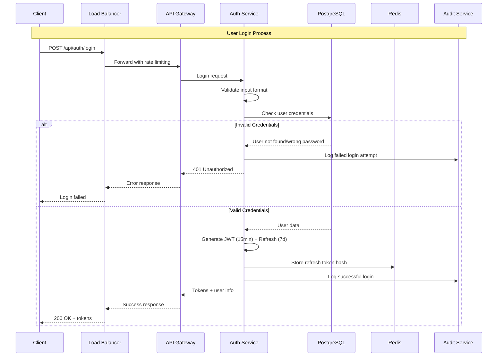
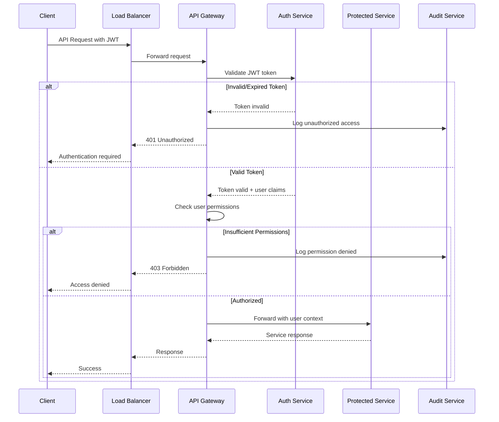
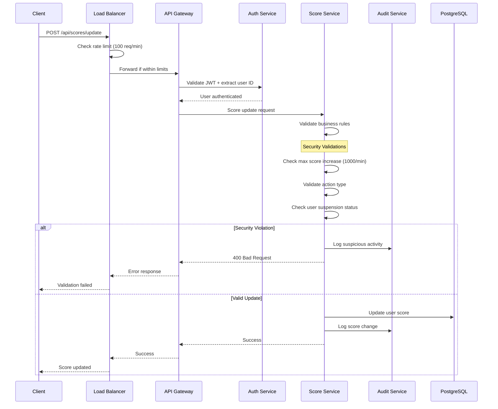

# Security Flow Diagrams

## Authentication Security Flow

```mermaid
sequenceDiagram
    participant Client
    participant LB as Load Balancer
    participant AGW as API Gateway
    participant AUTH as Auth Service
    participant DB as PostgreSQL
    participant REDIS as Redis
    participant AUDIT as Audit Service

    Note over Client,AUDIT: User Login Process
    Client->>LB: POST /api/auth/login
    LB->>AGW: Forward with rate limiting
    AGW->>AUTH: Login request
    
    AUTH->>AUTH: Validate input format
    AUTH->>DB: Check user credentials
    
    alt Invalid Credentials
        DB-->>AUTH: User not found/wrong password
        AUTH->>AUDIT: Log failed login attempt
        AUTH-->>AGW: 401 Unauthorized
        AGW-->>LB: Error response
        LB-->>Client: Login failed
    else Valid Credentials
        DB-->>AUTH: User data
        AUTH->>AUTH: Generate JWT (15min) + Refresh (7d)
        AUTH->>REDIS: Store refresh token hash
        AUTH->>AUDIT: Log successful login
        AUTH-->>AGW: Tokens + user info
        AGW-->>LB: Success response
        LB-->>Client: 200 OK + tokens
    end
```

## Authorization Security Flow

```mermaid
sequenceDiagram
    participant Client
    participant LB as Load Balancer
    participant AGW as API Gateway
    participant AUTH as Auth Service
    participant SERVICE as Protected Service
    participant AUDIT as Audit Service

    Client->>LB: API Request with JWT
    LB->>AGW: Forward request
    AGW->>AUTH: Validate JWT token
    
    alt Invalid/Expired Token
        AUTH-->>AGW: Token invalid
        AGW->>AUDIT: Log unauthorized access
        AGW-->>LB: 401 Unauthorized
        LB-->>Client: Authentication required
    else Valid Token
        AUTH-->>AGW: Token valid + user claims
        AGW->>AGW: Check user permissions
        
        alt Insufficient Permissions
            AGW->>AUDIT: Log permission denied
            AGW-->>LB: 403 Forbidden
            LB-->>Client: Access denied
        else Authorized
            AGW->>SERVICE: Forward with user context
            SERVICE-->>AGW: Service response
            AGW-->>LB: Response
            LB-->>Client: Success
        end
    end
```

## Score Update Security Flow

```mermaid
sequenceDiagram
    participant Client
    participant LB as Load Balancer
    participant AGW as API Gateway
    participant AUTH as Auth Service
    participant SCORE as Score Service
    participant AUDIT as Audit Service
    participant DB as PostgreSQL

    Client->>LB: POST /api/scores/update
    LB->>LB: Check rate limit (100 req/min)
    LB->>AGW: Forward if within limits
    AGW->>AUTH: Validate JWT + extract user ID
    AUTH-->>AGW: User authenticated
    
    AGW->>SCORE: Score update request
    SCORE->>SCORE: Validate business rules
    
    Note over SCORE: Security Validations
    SCORE->>SCORE: Check max score increase (1000/min)
    SCORE->>SCORE: Validate action type
    SCORE->>SCORE: Check user suspension status
    
    alt Security Violation
        SCORE->>AUDIT: Log suspicious activity
        SCORE-->>AGW: 400 Bad Request
        AGW-->>LB: Error response
        LB-->>Client: Validation failed
    else Valid Update
        SCORE->>DB: Update user score
        SCORE->>AUDIT: Log score change
        SCORE-->>AGW: Success
        AGW-->>LB: Success
        LB-->>Client: Score updated
    end
```
