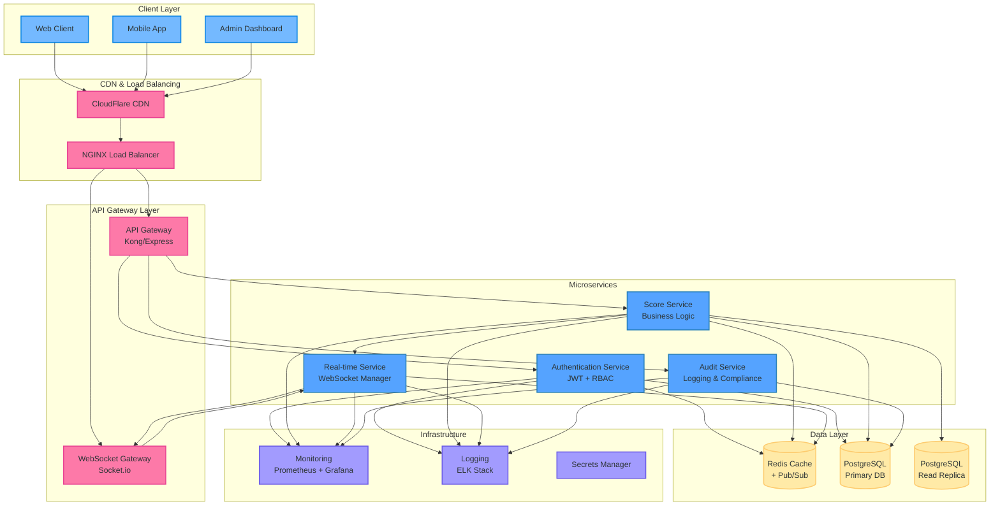

# System Architecture Diagram

## Component Descriptions

### Client Layer
- **Web Client**: React/Vue.js SPA with real-time scoreboard display
- **Mobile App**: React Native/Flutter app with push notifications
- **Admin Dashboard**: Administrative interface for system management

### Gateway Layer
- **API Gateway**: Request routing, authentication, rate limiting, logging
- **WebSocket Gateway**: Manages real-time connections with fallback support

### Microservices
- **Authentication Service**: JWT token management and RBAC
- **Score Service**: Core business logic for score management and validation
- **Real-time Service**: WebSocket connection management and broadcasting
- **Audit Service**: Security logging and compliance tracking

### Data Layer
- **Redis**: Caching layer and pub/sub for real-time updates
- **PostgreSQL**: Primary database with read replicas for scaling
- **Read Replicas**: Dedicated read instances for query performance